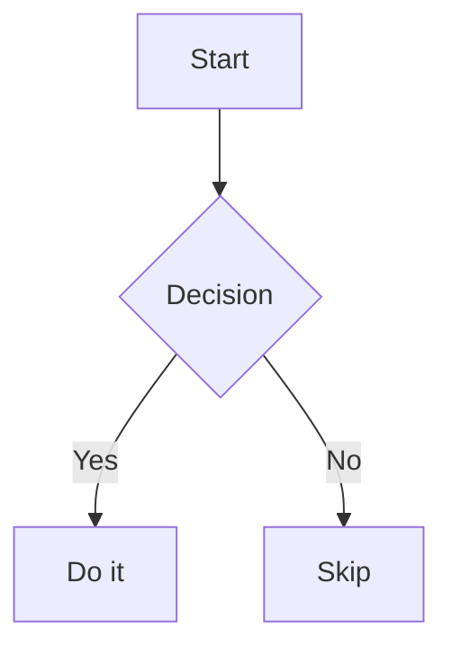

# rspress-plugin-mermaid-js

An [rspress](https://rspress.rs) plugin that renders Mermaid diagrams as interactive SVGs — pan, zoom, and fullscreen support, with automatic light/dark theme switching.

Unlike static-image plugins, this renders Mermaid directly in the browser so you can navigate large, complex diagrams without losing detail.

## Install

```bash
npm install rspress-plugin-mermaid-js
# or
pnpm add rspress-plugin-mermaid-js
```

## Usage

```ts
// rspress.config.ts
import { defineConfig } from '@rspress/core';
import { pluginMermaid } from 'rspress-plugin-mermaid-js';

export default defineConfig({
  plugins: [pluginMermaid()],
});
```

Then use `mermaid` code blocks in any `.md` or `.mdx` file:

````md

````

## Options

| Option          | Type                                                                     | Default | Description                                           |
| --------------- | ------------------------------------------------------------------------ | ------- | ----------------------------------------------------- |
| `height`        | `number`                                                                 | `480`   | Diagram container height in pixels                    |
| `mermaidConfig` | [`MermaidConfig`](https://mermaid.js.org/config/schema-docs/config.html) | `{}`    | Mermaid configuration options passed to every diagram |

```ts
pluginMermaid({
  height: 600,
  mermaidConfig: { theme: 'forest' },
});
```

## Features

- **Pan** — drag to move around the diagram
- **Zoom** — ⌘/Ctrl + scroll, or use the toolbar buttons
- **Fullscreen** — toggle for maximum diagram space
- **Reset** — one click to restore the original view
- **Light/dark theme** — automatically follows the rspress theme
- **Error display** — shows the error message and raw code on render failure

## License

MIT
